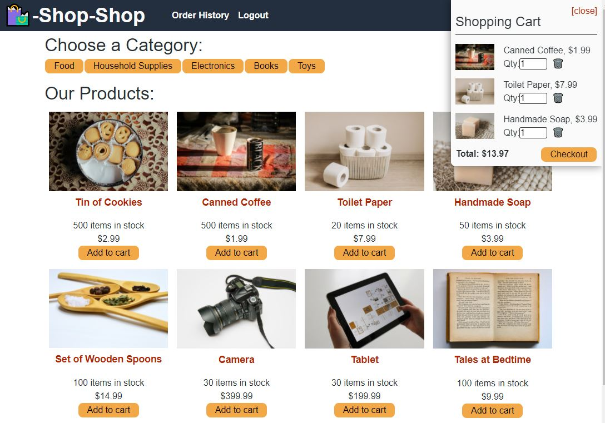

# Online Shopping Application: Shop-Shop

## Purpose
To create an online shopping application, offering various food, household supplies, electronics, books, and toys for sale.

## Features
When the user loads the site, they are able to view a homepage with various products from cookies, to toilet paper, to soap. The user can add products from the homepage to the shopping cart OR navigate to a desired category to view the products within that designation. When navigating to a specific category, the user can select a product and add it to the shopping cart. When adding to the shopping cart, the cart will open and display the options to edit the quantity or checkout. Upon checkout, the user is redirected to a Stripe payment page to enter their information. The user is notified of successful payment completion and redirected back to the site to continue shopping.

## Built With
* React JS
* JavaScript
* Apollo
* GraphQL
* Heroku
* Node JS 
* NoSQL - MongoDB
* Express
* Mongoose
* Concurrently

## Usage
To run program: node server

## Deployed Application
https://shop-shop2468.herokuapp.com/

## Project Status
Shop-Shop is complete in adherence with acceptance criteria

## Contribution
Created by Jennifer Mulder
